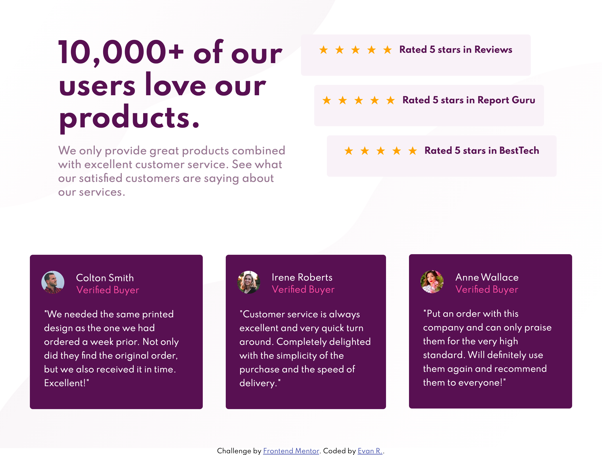
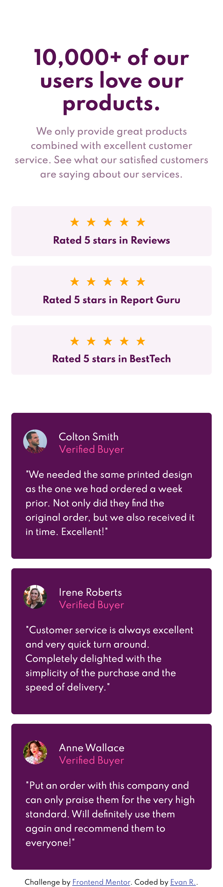

# Frontend Mentor - Social proof section solution

This is a solution to the [Social proof section challenge on Frontend Mentor](https://www.frontendmentor.io/challenges/social-proof-section-6e0qTv_bA). Frontend Mentor challenges help you improve your coding skills by building realistic projects.

## Table of contents

- [Overview](#overview)
  - [The challenge](#the-challenge)
  - [Screenshot](#screenshot)
  - [Links](#links)
- [My process](#my-process)
  - [Built with](#built-with)
  - [What I learned](#what-i-learned)
  - [Useful resources](#useful-resources)
- [Author](#author)

## Overview

### The challenge

Users should be able to:

- View the optimal layout for the section depending on their device's screen size

### Screenshot




### Links

- Solution URL: [Add solution URL here](https://your-solution-url.com)
- Live Site URL: [Add live site URL here](https://your-live-site-url.com)

## My process

### Built with

- Semantic HTML5 markup
- CSS custom properties
- Flexbox
- Mobile-first workflow

### What I learned

This is my first attempt using SCSS/ SASS. I liked the nesting method and css variables. I had just went through Kevin Powell's Flexbox mini-course, free from his youtube channel and I wanted to apply the Flexbox knowledge I learned. It was a tremendous help and I wish I had done that course sooner because it would've saved me a lot of time in the long run and made all my desings more responsive. I hated CSS before watching his videos, so I can't reccommend his channel enough. While my design isn't perfect, I created it way faster and it's an improvement from my previous layouts.

```css - found out how to combine to background images as such
.bg-wrapper {
  margin: 0 auto;
  padding: 5% 0;
  background-image: url("images/bg-pattern-top-desktop.svg"),
    url("images/bg-pattern-bottom-desktop.svg");
  background-repeat: no-repeat, no-repeat;
  background-position: left top, right bottom;
  // height: 100vh;
}
```

```scss - using the :nth of type selector
.social--container {
  display: flex;
  height: 300px;
  margin: 0 auto;
  justify-content: space-between;

  .social--card:nth-of-type(1) {
    align-self: flex-start;
    margin-right: 2.5rem;
  }

  .social--card:nth-of-type(2) {
    align-self: center;
  }

  .social--card:nth-of-type(3) {
    align-self: flex-end;
    margin-left: 2.5rem;
  }
}
```

If you want more help with writing markdown, we'd recommend checking out [The Markdown Guide](https://www.markdownguide.org/) to learn more.

### Useful resources

- [Kevin Powell - Responsive Layouts Course](https://courses.kevinpowell.co/courses/conquering-responsive-layouts/233002-introduction) - Hope this link can help others the way it helped me.

**Note: Delete this note and replace the list above with resources that helped you during the challenge. These could come in handy for anyone viewing your solution or for yourself when you look back on this project in the future.**

## Author

- Website - [Evan R.](https://www.reznitek.com)
